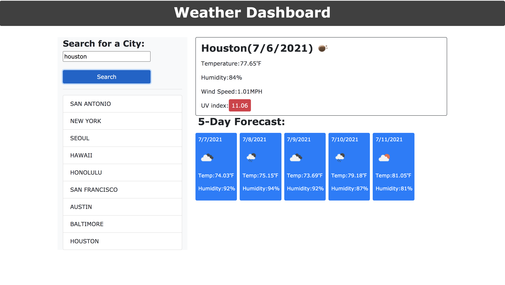

# weather-dashboard

## Description

The purpose of this project was to utilize the OpenWeather One Call API to retreive weather data for cities. By using localStorage, my program can store any persistant data. This website can be used to check the weather for multiple cities. When the user searches a city, they are presented with current and future conditions for that city and it is added to the search history. The current weather conditions given display the city name, the date, an icon representation of weather conditions, the temperature, the humidity, the wind speed, and the UV index. The UV index will be red for unfavorable conditions and green for favorable. It also presents a 5-day forecast. WHen the city is pressed from the search history, the current and future conditions for that city are displayed.

## Links
- [Deployed Website](https://erinlim2001.github.io/weather-dashboard/)
- [Code Repository](https://github.com/erinlim2001/weather-dashboard)

## Installation

1. Clone the repository using "git clone" followed by the SSH key or HTTPS 
2. It will contain an index.html file, a README.md, style.css, and a script.js file.

## Usage

You will be able to view the website on a desktop web browser once it is deployed.

Desktop Screen:

## Credits

### Tutorials Used
* [https://openweathermap.org/forecast5](https://openweathermap.org/forecast5)
* [https://openweathermap.org/api/solar-radiation](https://openweathermap.org/api/solar-radiation)
* [https://openweathermap.org/current](https://openweathermap.org/current)

## License

